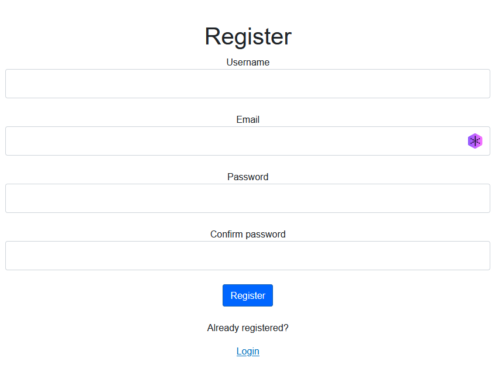

# Multi-Factor Authentication

### *Internship project*
---

## Description

An authentication app that provides multi-factor authentication (currently only through e-mail).
It supports both activation and recovery of the multi-factor element.
It relies on a REST API that uses JWT and a database with encrypted data.

*Comes with a dummy webpage.*

## Features
* Dummy web interface
* REST API
* JWT authentication
    - Strong private key
    - RSA + SHA256 token validation
    - Payloads without sensitive data
    - 1 min. **Access** / 1 hour **Refresh** tokens
* Two Factor Authentication
    - Activation and recovery
    - Currently only through **email**
    - Supports extensibility
* Database encryption 
    - Argon2 Hashing
    - w/ Salt

## Demonstration

https://github.com/alexxarisis/Multi-Factor-Authentication/assets/65713456/f924269e-bfc5-4f9c-adb4-45995a885193

## Screenshots

### Login

### Register

### Two factor authentication activation - Step 1

### Two factor authentication activation - Step 2

### Two factor authentication activation - Step 3

### Home (Logged in)

### Two factor authentication (Login when it is already activated)

## Installation

* Visual Studio 2022
    - ASP.NET and web development
    - .NET desktop development
* Docker desktop

## How to run

1. Go to the `API` directory and open `API.sln` in Visual Studio.
2. Go to `appsettings.json` and configure the `EmailService`.
    - In case you have none, i suggest [Brevo](https://www.brevo.com/) (Rebrand of *sendinblue*).
3. Run `Docker Compose`.
4. Wait for the container to be created.
5. Go to the `Client` directory, open `Client.sln` in Visual Studio and run it.
6. Wait till a browser window opens.
